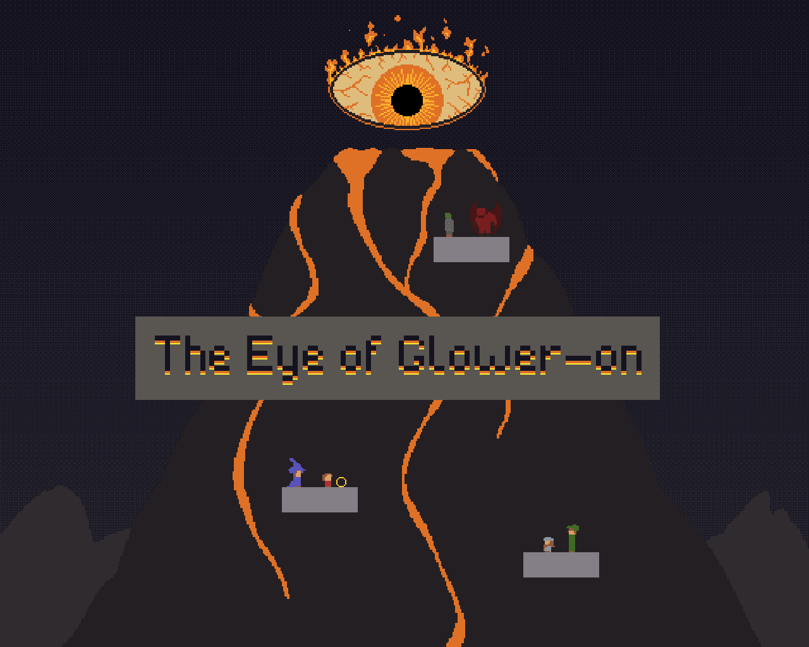

# The Eye of Glower-On

> _**[Play the game!](https://levi.dev/eye-of-glower-on)**_
> 
> _**[Watch the gameplay video!](https://youtu.be/PsbyLwgKQr0)**_
> 
> _**[Checkout the original version that was submitted to Ludum Dare!](https://ldjam.com/events/ludum-dare/49/ludum-dare-49)**_

  

_In this point-and-click game, you control the vast power of an unstable mountain._

> The heroes of the land aim to ascend **Mount Oh No** to destroy the vessel of your vast power! You must CRUSH THEM! And send them flying! They will FEEL YOUR ANGER!! They think they can scale Mount Oh No?? Not while **The Eye of Glower-On** is watching!

  

## Software used

-   [Godot](https://godotengine.org/): Game engine.
-   [Piskel](https://www.piskelapp.com/user/5663844106502144): Pixel-art image editor.
-   [Aseprite](https://www.aseprite.org/): Pixel-art image editor.
-   [Bfxr](https://www.bfxr.net/): Sound effects editor.
-   [DefleMask](https://deflemask.com/): Chiptune music tracker.
-   [Surfacer](https://github.com/SnoringCatGames/surfacer/): A framework that enables procedural path-finding across 2D platforms.
-   [Scaffolder](https://github.com/SnoringCatGames/scaffolder/): A framework that provides some general app infrastructure.

## Licenses

-   All code is published under the [MIT license](LICENSE).
-   All art assets (files under `assets/images/`, `assets/music/`, and `assets/sounds/`) are published under the [CC0 1.0 Universal license](https://creativecommons.org/publicdomain/zero/1.0/deed.en).
-   This project depends on various pieces of third-party code that are licensed separately. Here are lists of these third-party licenses:
    -   [addons/scaffolder/src/config/scaffolder_third_party_licenses.gd](https://github.com/SnoringCatGames/scaffolder/blob/master/src/config/scaffolder_third_party_licenses.gd)
    -   [addons/surfacer/src/config/surfacer_third_party_licenses.gd](https://github.com/SnoringCatGames/surfacer/blob/master/src/config/surfacer_third_party_licenses.gd)
    -   [src/config/third_party_licenses.gd](./src/config/third_party_licenses.gd)

  

